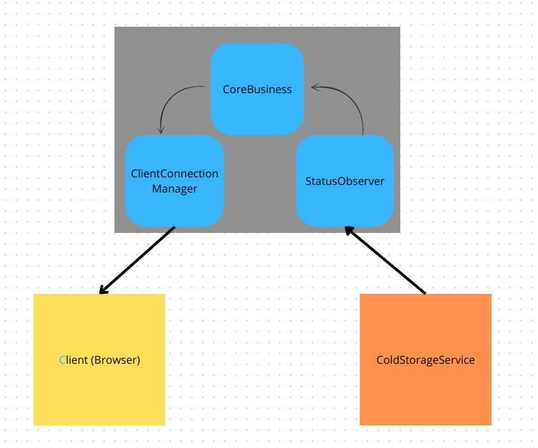
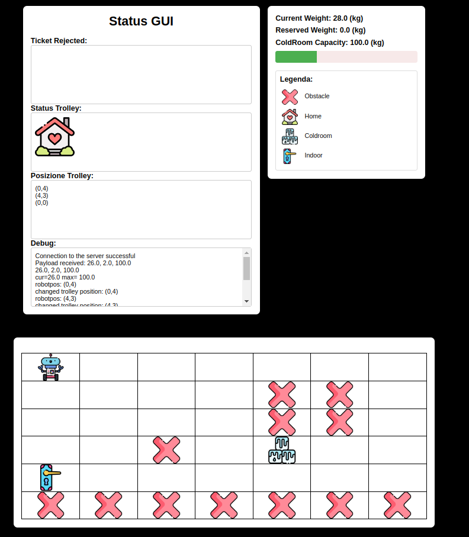
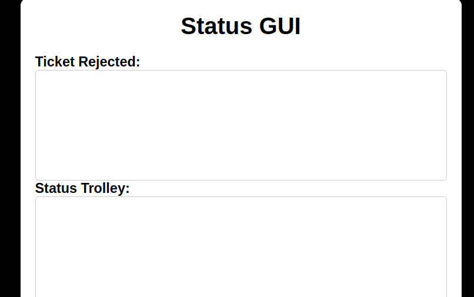
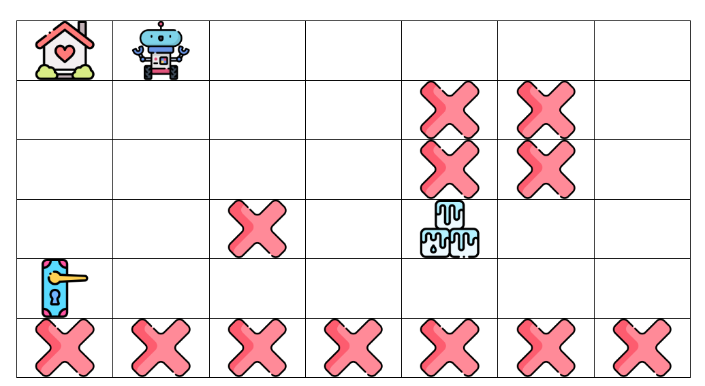
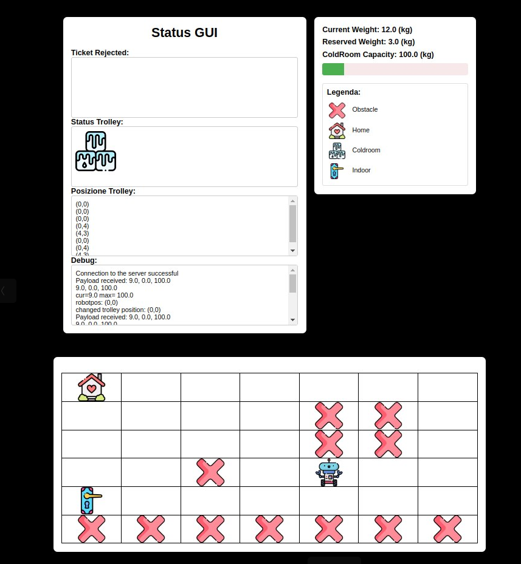
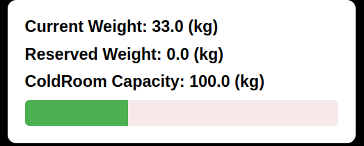
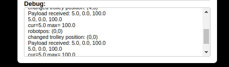

# Sprint3 - Analisi dei Requisiti

Lo scopo dello sprint è di analizzare e progettare la parte di requisiti inerente la "Service Status GUI", definita dai requisiti come un "pannello di controllo" col ruolo di mostrare ad un **operatore umano** e in ogni momento dell'esecuzione diversi aspetti del sistema ColdStorage. In particolare: 
- Il numero di ticket rigettati perché la ColdRoom è risultata full.
- Lo stato del trolley.
- La posizione del robot nella Service Area.
- Lo stato di riempimento della Cold room.

La discussione con il committente ha inoltre portato a definire un ulteriore requisito, vale a dire "La GUI deve essere UNICA e non è espressamente richiesto che operi in ambiente distribuito".

# Analisi del problema

Per realizzare le funzionalità appena descritte, ci si apre a una serie di possibili scelte implementative. Un'applicazione su dispositivo mobile, ad esempio, richiederebbe tuttavia la nomina di un utente "privilegiato" (proprietario o utilizzatore del device), cosa non richiesta e desiderata dai requisiti. Alternativamente, potrebbe trattarsi di un'applicazione distribuita con un deployment potenzialmente molto oneroso. Si potrebbe trattare localmente al ColdStorageService come un attore e realizzare, previo osservabilità delle risorse Coap, una GUI locale in grado di presentare all'utente le informazioni richieste.
Tuttavia si è scelto, in seguito all'analisi, di adottare le medesime scelte effettuate per lo sprint2 e la Service Access GUI, relizzando la StatusGUI mediante creazione di un ServerWeb. I motivi, non diversi dallo sprint2, sono i seguenti:
- Flessibilità e possibilità di collegare ogni tipo di dispositivo mediante comune browser.
- Mobilità garantita ad ogni livello mediante protocolli di comunicazione standard (HTML/Ws/Coap...)
- Sviluppo rapido ed efficace, curando la presentazione e aggiornamento  attraverso un deployment leggero.
- Costi e tempi ridotti per la possibilità di riuso di componenti della precedente GUI.

L'operatore dovrà essere unico in ogni momento e questo si potrà comunque realizzare aggiornando ed eleggendo in maniera reversibile la **prima connessione avvenuta al server**.
Per poter riutilizzare componenti già sviluppate e collaudate, la scelta della tecnologia ha prediletto i già precedentemente utilizzati SpringBoot (framework leggero e comodo per la l'automatizzazione e configurazione) e TomCat (Server Web basato su Servlet Java). 

# Progettazione

SpringBoot si basa sul pattern MVC e dispone al **Controller** la possibilità di impostare metadati utili all'esecuzione mediante le **Java annotations**, in particolare i mapping utili per l'elaborazione di una Get HTTP lato client. Trattandosi di una pagina semplice, abbiamo gestito solo il mapping root `"/"`, gestita dal Controller con l'annotazione  `@GetMapping`.

All'avviamento, il framework predispone la configurazione del server in maniera automatica, fissando come porta 8087 per la connessione(`/resources/application.properties`).

Riferendoci al Model, questo viene organizzato secondo un'architettura Triagolare:

Le tre componenti nei riquadri azzurri consistono in classi Java (POJO) definite dallo sviluppatore all'interno del framework Spring (riquadro grigio). Le ragioni di una simile architettura sono da ricercare nei dettami del principio di singola responsabilità per svincolare il più possibile la funzioni di connesione ("Client Connection Manager" verso il **client inteso come browser** "Status Observer" verso il ColdStorageService, attivato su contesto potenzialmente remoto) dall'effettivo **Core Business** del server, inteso come logica attesa di inoltro dei messaggi, ricezione e formattazione del payload.

Caso di funzionamento:

- All'avvio, la componente `StatusObserver` avvia quattro distinte connessioni e client Coap, registrandosi verso il ColdStorageService (server Coap, IP configurabile e porta 8055) e basicrobot (porta 8020) ad altrettanti "topic" definiti dal nome dell'attore da monitorare (coap resources).
- l Client (browser) riceve la pagina HTTP che presenta diversi campi per mostrare a schermo le informazioni richieste.

All'arrivo di un evento innescato da un attore interno al ColdStorageService:

 - Si innesca la callback **Asincrona** relativa alla connessione specifica di risposta, estraendo il messaggio in arrivo e trasferendolo al **CoreBusiness**
 - Il messaggio viene qui elaborato con metodi differenziati per casistica di payload in arrivo, e quindi trasferito al ClientConnectionManager
 - Si inoltra al Client (Browser) mediante Websocket, una volta trasferito il messaggio rielaborato al ClientConnectionManager.
 - Si aggiornano lato Client i campi ricevuti in maniera **asincrona** attraverso la WebSocket.

### Client Connection Manager
Componente "passivo" rappresentato da un POJO e realizzato come classe JAVA. Ha il solo scopo di gestire coi suoi metodi le connessioni verso Client esterni. Estende la classe `AbstractWebSocketHandler`, richiesta esplicitamente dal framework per realizzare la comunicazione mediante WebSocket. 

Dovendo semplicemente monitorare lo stato di una singola connessione, dispone di un metodo per instaurarla, dismetterla oppure inviare messaggi (la ricezione non serve in alcun modo in quanto la GUI è completamente passiva).

### Core Business

Componente (POJO) per il coordinamento ad alto livello. Il principio dell'inversione delle dipendenze porta alla delegazione della maggior parte delle operazioni ai due POJO (Client e Service Connection Manager), di cui la GUI è essa stessa un POJO tramite i loro attributi private di classe. Viene pertanto acceduta da questi mediante metodi definiti **public**.

 metodi definiti per la classe sono:
 - **public void gotUpdateFromCSS(String msg, String requestId)**: riceve i messaggi direttamente dalla classe "StatusObserver" e innesca gestioni differenziate a seconda della loro origine
 - **public String getValue(String msg)**: gestione del payload usata per la maggior parte degli aggiornamenti per estrarre un singolo valore intero tramite pattern matching.
 - **public String getPosition(String msg)**: gestione del payload usata per estrarre una posizione in coordinate (es `(X,Y)`) tramite pattern matching.
 - **private void updateCount(String data)**: serve ad estrarre i parametri di stato della coldroom dai dispatch tramite pattern matching.

### StatusObserver

Si tratta di una classe custom per gestire un insieme di connessioni che sfruttano il protocollo applicativo Coap.
Coap permette un'efficiente e semplice pattern observer, mediante istanziazione di oggetti CoapConnection con relativo CoapConnectionHandler.
Quest'ultima è nativamente classe astratta che richiede la ridefinizione dei metodi "onLoad" e "onError" mediante `@Override`. Il primo, gestisce la callback asincrona all'arrivo di un evento oppure la risposta all'invio di un messaggio `get` da parte del coap client mentre il secondo eventuali segnalazioni di errore nella connessione.

**Perchè non MQTT?** Il sistema appena descritto mira ad essere il più leggero possibile e si è deciso di escludere l'introduzione di broker pesante e gestire ogni connessione autonomamente come topic a sè stante.

E' nostro interesse osservare:
- gli aggiornamenti da parte del ColdRoom sullo stato in tempo reale di peso, spazio riservato e Max storage.
- gli aggioramenti da parte del TransportTrolley sullo stato corrente di movimento del robot ("GoingHome" etc..).
- gli aggiornamenti da parte del BasicRobot sulla posizione attuale del robot nella ServiceArea.
- gli aggiornamenti da parte del ColdStorageService riguardanti il numero incrementale di ticket rifiutati.

Questo viene realizzato, lato ColdStorageService mediante aggiunta della primitiva `updateResource` nello stato adeguato dei suddetti attori.

Esempio:

## Client
L'interfaccia web viene realizzata con html, css e javascript. E' stato scelto un design semplice e intuitivo per facilitare le operazioni. 

In particolare i campi sono:
**Ticket Rejected** e **Status Trolley**:
Il primo serve a mostrare a schermo un conteggio cumulativo dei ticket rigettati dal sistema dal suo avvio perché lo spazio è insufficiente, mentre il secondo mostra un'immagine corrispondente ai vari stati di esecuzione del robot.

**Robot Position**:
Una griglia suddivisa in spazi quadrati, virtualmente della dimensione di uno "step" del robot. La legenda delle immagini rappresenta con una "X" eventuali pareti o ostacoli, con i cubetti di ghiaccio la ColdRoom, con una casa la Home, una porta per l'Indoor e con un robottino il Transport Trolley.

**Coldroom status**:
Similmente a quanto accaduto nella ServiceAccessGui, viene realizzata una barra di caricamento per raffigurare il riempimento della ColdRoom. 

## Testing

Un piano di testing finale è stato effettuato inoltre controllando la consistenza del comportamento del robot (controllato via AccessGUI) con l'output visualizzato.
In particolare, un si è deciso di servirci anche di una comoda schermata di debug per visualizzare il comportamento interno del sistema similmente ad un file di log:

## Deployment

Il sistema può essere avviato semplicemente da riga di comando, generando il WebServer e instaurando automaticamente le connessioni all'IP e porta preconfigurate.

- navigando nel percorso:
	`/coldStorageService/sprint3/sprint3_accessGUI`

-  richiamando il comando:
	`./gradlew bootRun`
