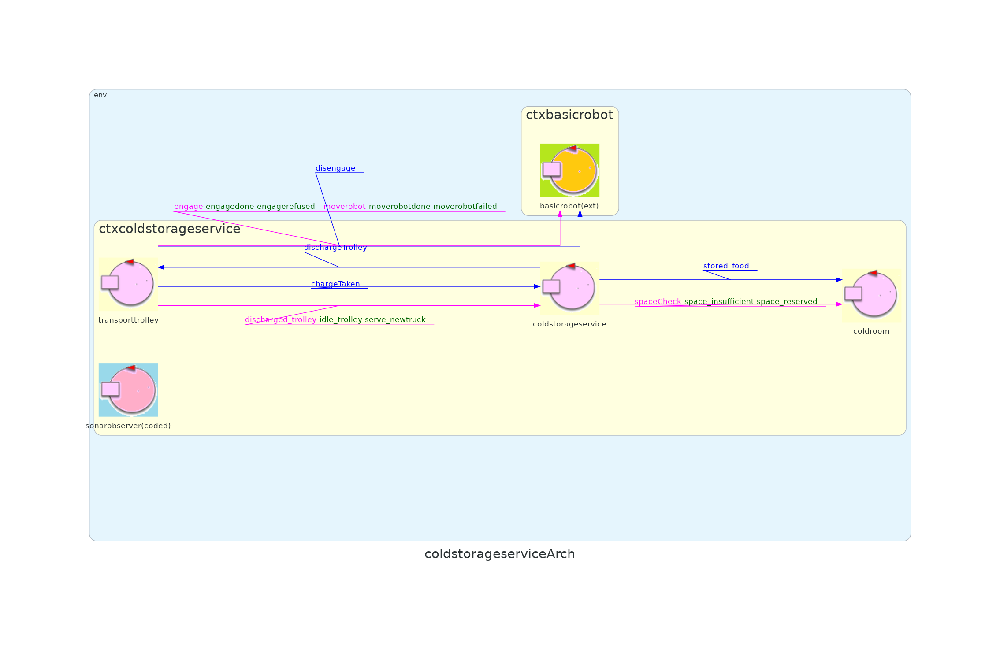
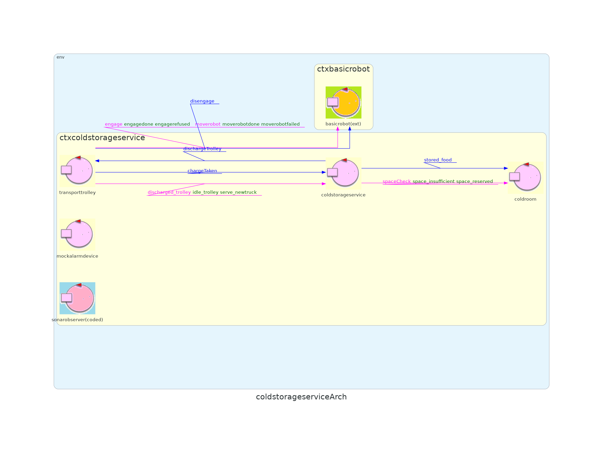

# Sprint4   
# Obiettivo   
L'obiettivo dello Sprint4 è di introdurre nel sistema i componenti **Alarm Device** e **Warning Device**    
# Analisi dei requisiti   
Stando ad [alarm requirement](https://hjcsteve.github.io/coldStorageService/iss23Material/html/TemaFinale23.html#alarm-requirements) il sistema deve inclure un **Sonar** e un **Led** connesse ad un **RaspberryPi**   
Non vi sono vincoli su dove devono stare queste 2 entità, pertanto possono anche non essere connesse direttamente sul DDR robot.   
# Analisi del problema   
## Come far interagire il warning device e l'alarm device con il coldstorageservice?   
Nello Sprint1 abbiamo introdotto nel sistema un **broker MQTT** che fa intermediatario per l'osservazione dello stato interno dell'attore transport trolley. 
Ponendo un broker come intermediatario di comunicazione abbiamo i seguenti vantaggi nell'architettura:   
- **Disaccoppiamento dello spazio**: si fornisce una singola astrazione di nome (indirizzo del broker MQTT) a tutti i componenti del sistema distribuito   
- **Maggiore scalabità**: gli servizi esterni o nuovi componenti del sistema interessati a ricevere informazioni possono farlo senza conoscere direttamente i nomi degli attori del sistema   
- **Maggiore supporto**: si dispone di ampie librerie di supporto per integrare su un qualsiasi sistema IoT   
   
Si sfrutta quindi tutta l'infrastruttura già implementata nello Sprint1 per la comunicazione con i RaspberryPi. Perciò occorre introdurre un client MQTT sui RaspberryPi e definire sul contesto coldStorageService un handler per la ricezione dei topic.   
In particolare bisogna introdurre due topic, uno per il warning device e uno per l'alarm device   
L'informazione dello stato interno del transport trolley, necessario per il funzionamento del warning device, è stato già introdotto nello sprint1 come topic `trolley\_state`    
Quindi deve essere introdotto un solo nuovo topic MQTT `sonardata` , con il quale rappresentiamo i dati raccolti dal Sonar.   
   
## Come produrre i dati dal sonar   
Dall'analisi del problema si deducono queste necessità:   
- Leggere i dati dal Led fisico sul dispositivo RaspberryPi   
- Pubblicare i dati raccolti sul topic MQTT   
   
Per abbattere il costo di sviluppo, in ambiente raspberryPi è scelto di implementare i vari software con il linguaggio **python**   
Si definisco 2 script python ognuno specializzato nei compiti descritti, messi in **pipeline**, dove ogni script consuma l'output di quello precendente.
   
Il primo script `sonar.py` deve leggere in base alla tecnologia presente sul RaspberryPi la **distanza rilevata**, e produrre in output la distanza   
Il secondo script `mqttSonarPublisher.py` deve consumare l'output del primo attore e **pubblicare sul topic** `sonardata`  la distanza rilevata dal sonar
Per motivo di facile estensione sulla infrastuttura già presente, la logica d[i alarm requireme](https://hjcsteve.github.io/coldStorageService/iss23Material/html/TemaFinale23.html#alarm-requirements)nt deve essere inserita all'interno del contesto qak coldstorageservice   
   
## Come fermare il trasport trolley?   
Nello sprint1 abbiamo definito dei eventi nel modello qak del contesto coldstorageservice:   
- **alarm**: ferma il transport trolley e lo blocca fino alla ricezione dell'evento`resume`   
- **resume**: sblocca il transport trolley e lo ripristina allo stato precendete al blocco   
   
Avendo già le interazioni già definite, occorre solamente **estendere il sistema** con la logica dell'alarm requirement.   
Si decide di introdurre nel sistema una nuova entità `sonarobserver` che incapsula la logica necessaria e che immette correttamente nel sistema gli eventi** alarm** e** resume**   
Dato che deve:   
- Fare il subscribe al topic presso la broker MQTT   
- Elaborare i messaggi ricevuti e immettere eventi qak nel contesto di coldstorageservice   
- Essere un estensione senza dover modificare gli attori già presenti   
-  deve avere un ciclo di vita proprio indipendente   
   
Per tanto deve essere un **attore**.   
```
CodedQActor sonarobserver context ctxcoldstorageservice className "codedActors.Sonarobserver"
```
## Come consumare i dati dello stato del transport trolley   
Analizzando il problema si deducono queste necessità:   
- Osservare i cambiamenti del transport trolley   
- Convertire gli stati del transport trolley agli stati del warning device   
- Comandare il led fisico in base allo stato ricevuto   
   
Per soddisfare queste necessità analogamente al sonar si crea una **pipeline** di script: `mqttListerner.py` e `ledController.py` sempre implementata con linguaggio **python**   
Sul topic `trolley\_state` sono pubblicati gli stati del transport trolley. Di conseguenza il primo attore `mqttListerner.py`deve fare subscribe a tale topic e convertire agli stati del warning device.   
Il secondo attore `ledController.py` deve quindi consumare l'output dell'attore precedente e pilotare il led fisico   
## Architettura logica   
    
   
## Test plan   
Per testare la logica di alarm requirement prima di passare dal raspberryPi è stato creato un attore che prendesse i dispatch da un ente esterne (il test in JUnit) e pubblicasse sul topic `sonardata`   
```
QActor mockalarmdevice context ctxcoldstorageservice{
	State s0 initial {
		println("$name | sub a broker") color red
		connectToMqttBroker "tcp://localhost:1883"	
  } 
  Transition t0 whenMsg mocksonardata -> handleSonarData
  State handleSonarData {
  	onMsg(mocksonardata : mocksonardata(DIST)){
  		[# val DISTANCE = payloadArg(0) #]
			println("$name | pubblico $DISTANCE") color red
  		
			publish "sonardata" -m mocksonarevent:$DISTANCE
			
	}
  } Goto s0
}
```
```
        //mandiamo la request per avere il ticket
        val ticketRequestStr = CommUtils.buildRequest("tester", "storerequest", "storerequest(35)", "coldstorageservice").toString()
        val ticketresponseMessage = conn.request(ticketRequestStr)
        assertTrue("TEST___ il ticket accettato ",
                ticketresponseMessage.contains("ticketAccepted"));
        //mando una richiesta di discarge food
        val truckRequestStr = CommUtils.buildRequest("tester", "dischargefood", "dischargefood(1)", "coldstorageservice").toString()
        val responseMessage = conn.request(truckRequestStr)
        assertTrue("TEST___ charge taken",
                responseMessage.contains("replyChargeTaken"));
        Thread.sleep(500)
		//il mock sonar pubblica 1 per far scattare lo stop
        val alarm = CommUtils.buildDispatch("tester", "mocksonardata", "mocksonardata(1)","mockalarmdevice").toString();
        conn.forward(alarm)
        Thread.sleep(3000)
		// dopo 3 secondi fa scattare il resume
        val resume = CommUtils.buildDispatch("tester", "mocksonardata", "mocksonardata(100)","mockalarmdevice").toString();
        conn.forward(resume)
        Thread.sleep(500)
        val alarm2 = CommUtils.buildDispatch("tester", "mocksonardata", "mocksonardata(1)","mockalarmdevice").toString();
        conn.forward(alarm2)

        //verifico gli stati osservati
        val messagesMQTT = myMqttCallback.getMessagesMQTT();
        print( myMqttCallback.getMessagesMQTT().toString())
        val good="[trolley_state(goingIndoor), trolley_state(atIndoor), trolley_state(goingColdroom), trolley_state(stopped), trolley_state(goingColdroom)]"
        assertTrue("TEST___ transport_state",
                messagesMQTT.toString()== good
        )
```
    
# Progettazione    
In fase di progettazione si sono scelti di usare la libreria RPi.GPIO per pilotare device fisici   
I pin del **Raspberry** coinvolti sono:   
- **GPIO 4**: pin TRIG sonar   
- **GPIO 27**: pin ECHO sonar   
- **GPIO 25**: pin led   
   
Il sonar fisico produce dei dati sulla distanza dell'ostacolo e lo script consuma questi dati e li pubblica sul topic `sonardata`   
```
client= paho.Client("publisher")      
client.connect(brokerAddr,1883)         
while True:
    line = sys.stdin.readline().rstrip('\n')
    client.publish(topic,line)
```
lo script `mqttListener.py `descritto in analisi deve convertire gli stati del transport trolley secondo questo schema   
|                    **trolley\_state** | **led\_state** |
|:--------------------------------------|:---------------|
| goingIndoor, goingColdroom, goingHome |          blink |
|                                atHome |            off |
|                               stopped |             on |

```

    if "going" in msg:
        print("blink")
        sys.stdout.flush()
    elif "atHome" in msg:
        print("off")
        sys.stdout.flush()
    elif "stopped" in msg:
        print("on")
        sys.stdout.flush()
    return

```
# Deployment   
Sul root del progetto sono presenti i file script necessari per il build e il deployment   
`deploy.sh` indica come fare il build del progetto, fare il build dell'immagine docker e pubblicarlo su docker hub   
in questa repo `hjcsteve/coldstorageservice:4.0`   
   
